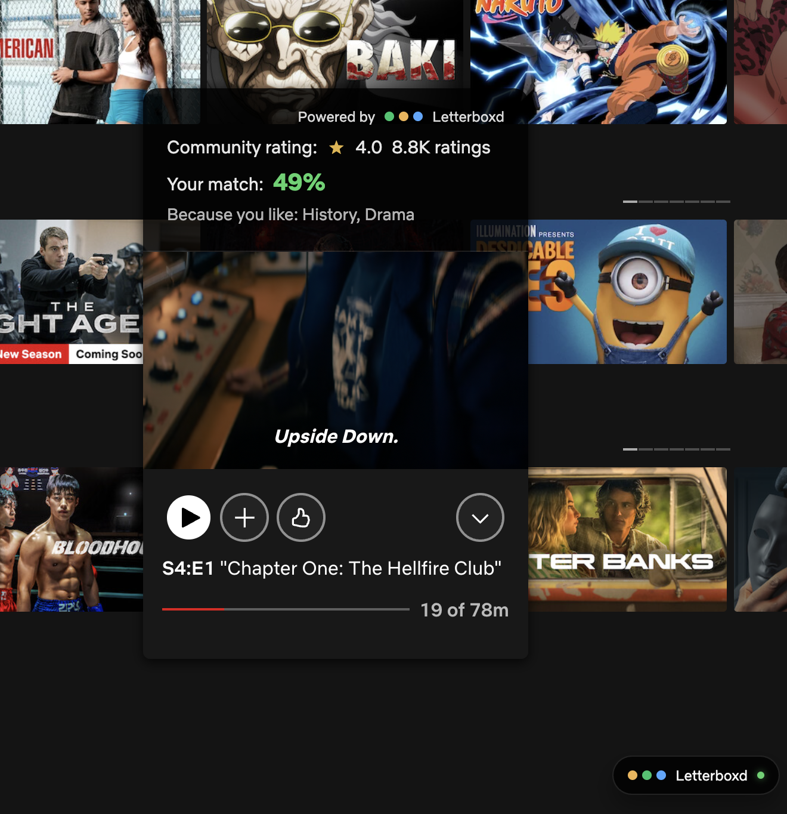

# Netflix + Letterboxd (Chrome Extension)

## Overview
Netflix + Letterboxd is a Manifest V3 Chrome extension that overlays Letterboxd-informed insights on Netflix expanded title cards. It uses your Letterboxd export ZIP for local personalization and TMDb for community ratings.

## Architecture
- Content script detects the expanded Netflix jawbone card and injects a Shadow DOM UI.
- Background service worker resolves titles via TMDb, merges Letterboxd signals, and computes match scores.
- Popup handles configuration and Letterboxd ZIP import.

See `docs/ARCHITECTURE.md` for full details.

## Local Development
```bash
npm install
npm run build
```

Load unpacked:
1. Open `chrome://extensions/`.
2. Enable **Developer mode**.
3. Click **Load unpacked** and select `dist`.

For watch builds:
```bash
npm run dev
```

## Demo
1. Open the extension popup and enable the overlay.
2. Paste your TMDb API key and save.
3. Upload your Letterboxd export ZIP.
4. Hover an expanded Netflix title card to see ratings, match score, and badges.

## Preview

<p align="center">
  
  <br />
  <em>Overlay with TMDb community rating and Letterboxd-powered match insights.</em>
</p>
