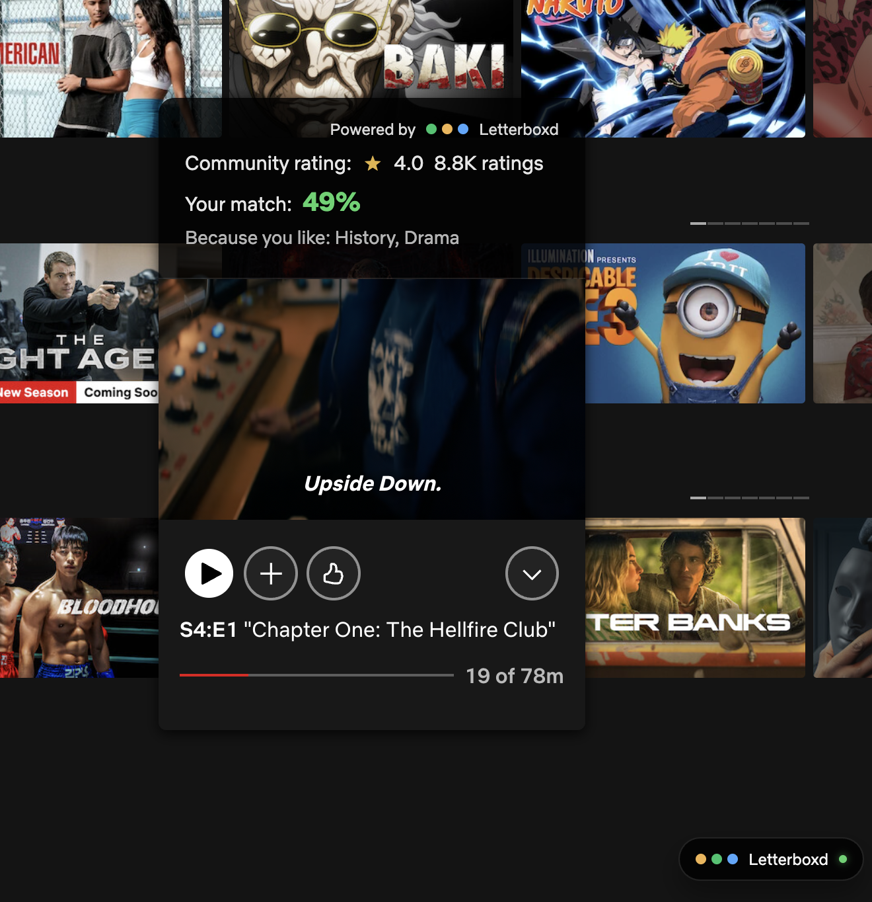

# Netflix + Letterboxd (Chrome Extension)

## Overview
Netflix + Letterboxd is a Manifest V3 Chrome extension that overlays Letterboxd-informed insights on Netflix expanded title cards, and (optionally) provides **X-Ray style actor recognition on paused playback scenes**. It uses your Letterboxd export ZIP for local personalization and TMDb for community ratings.

## Preview

<p align="center">
  
  <br />
  <em>Overlay with TMDb community rating and Letterboxd-powered match insights.</em>
</p>

## Architecture
- **Users need no API keys.** The extension talks to a small backend you deploy; that backend holds one TMDb API key and one set of AWS Rekognition credentials. Users only enable the overlay and (optionally) import their Letterboxd export.
- Content script detects the expanded Netflix jawbone card and injects a Shadow DOM UI on browse pages.
- Content script also hooks into the `/watch/*` player, watching for **pause** events to trigger X-Ray scene analysis.
- Background service worker calls your **backend proxy** for title resolution and X-Ray (or, if no proxy URL is set at build time, uses TMDb/AWS directly with user-supplied keys from storage).
- An offscreen document + `chrome.tabCapture` capture a single video frame for X-Ray, run local face detection (TensorFlow.js + `modern-face-api`), and return cropped faces to the background; the background sends those to the proxy for celebrity recognition and TMDb person/character lookup.
- Popup handles overlay toggle and Letterboxd ZIP import only.

See `docs/ARCHITECTURE.md` for full details.

### Backend proxy (recommended for “users don’t need keys”)

1. Deploy the Node server in `server/` (e.g. Fly.io, Railway, Render). Set env: `TMDB_API_KEY`, `AWS_ACCESS_KEY_ID`, `AWS_SECRET_ACCESS_KEY`, `AWS_REGION` (default `us-east-1`).
2. Build the extension with your backend URL:  
   `VITE_PROXY_BASE_URL=https://your-api.fly.dev npm run build`
3. Load the built `dist/` in Chrome. Overlay and X-Ray then use your backend; users never see or set TMDb or AWS keys.

```bash
cd server && npm install && npm start
# Or for production: set env vars and run on your host.
```

## X-Ray actor recognition

When you pause Netflix playback on a `/watch/*` page, the extension can show an **“In this scene”** panel on the right side of the screen listing the actors detected in the paused frame.

### Requirements (when using the backend proxy)

- **You** (the publisher) deploy `server/` with one TMDb API key and one set of AWS Rekognition credentials in env. **Users** do not need any keys.
- **Face detection models** (for `modern-face-api`):
  - Models are loaded from `chrome.runtime.getURL("models/")` if present, otherwise from a CDN fallback.
  - For best reliability, download the SSD MobileNet v1 face detection model and ship it under a `models/` folder in the built extension.

### How it works (high level)

1. **Pause detection**
   - Content script watches the main `<video>` element on `/watch/*`.
   - On `pause`, a debounced X-Ray analysis request is sent to the background (`ANALYZE_FRAME`).

2. **Frame capture**
   - Background uses `chrome.tabCapture.getMediaStreamId` for the current Netflix tab.
   - An offscreen document uses `getUserMedia` with that stream ID to grab a single frame at up to 1280×720.

3. **Local face detection**
   - Offscreen document runs `modern-face-api` (SSD MobileNet v1) on the captured frame.
   - Each detected face is cropped and encoded as a JPEG base64 blob.

4. **Celebrity recognition + TMDb enrichment**
   - Background sends each cropped face to AWS Rekognition’s `RecognizeCelebrities`.
   - For each recognized celebrity, the background looks up the corresponding TMDb person and combined credits, infers the **character name for the current title**, and builds an `XraySceneActor` entry with:
     - `name` (actor)
     - `character` (role in this title, when available)
     - `photoUrl` (TMDb profile image)
     - `confidence` (Rekognition match confidence, normalized to 0–1)

5. **UI overlay**
   - Content script renders a right‑side X-Ray panel listing “In this scene” actors with photo, name, character, and confidence badge.
   - On `play`, the panel hides automatically.

### Privacy & behavior

- **Video frames are never persisted**: a single frame is captured into an offscreen document, processed in memory, then discarded.
- Only **cropped face regions** (not full frames) are sent to AWS Rekognition.
- Cache:
  - Results are cached for 24h by `netflixTitleId` + time bucket (~2s granularity) to avoid re‑calling Rekognition for the same moment.
  - Cache lives in extension IndexedDB and can be cleared by resetting the extension data.
- If Rekognition or TMDb fail, the X-Ray panel falls back to generic entries (e.g. “Unknown”) and/or shows an inline error message.

### Security

- When using the **backend proxy**, TMDb and AWS keys live only on your server; the extension never ships or stores them. Users only use the overlay and (optionally) import their Letterboxd ZIP.
- If you self-host without a proxy and add your own key UI back, never commit keys or ship them in the extension bundle.

## Local Development
```bash
npm install
npm run build
```

Load unpacked:
1. Open `chrome://extensions/`.
2. Enable **Developer mode**.
3. Click **Load unpacked** and select `dist`.

For watch builds:
```bash
npm run dev
```

## Demo
1. Open the extension popup and enable the overlay (and X-Ray, if you make it togglable in UI).
2. Paste your TMDb API key and save.
3. Upload your Letterboxd export ZIP.
4. Hover an expanded Netflix title card to see ratings, match score, and badges.
5. Start playing a title on Netflix, **pause on a scene**, and look for the **“In this scene”** panel with detected actors on the right side of the screen.

## To Do
1. Watch history per movie/show.
